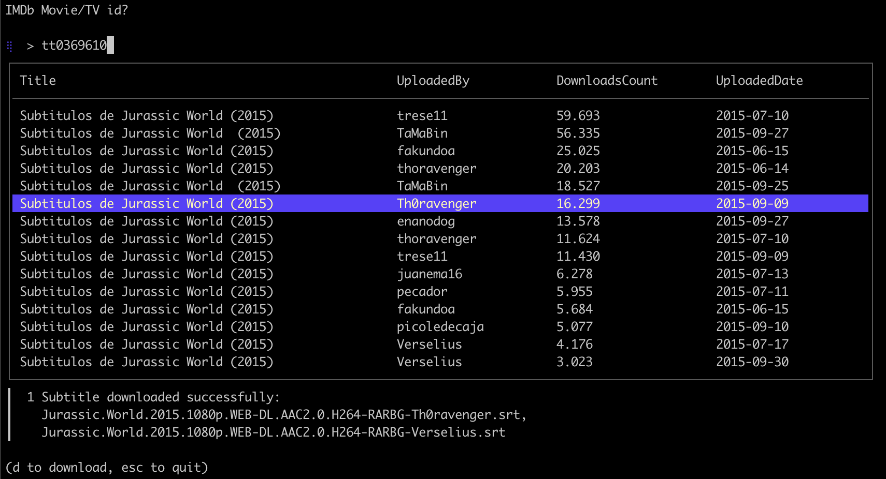

# SubDivX-dl:  Subtitle Downloader
This project is in development. It is a terminal application to download subtitles from subdivx.com.

## Purpose
The main purpose of this project is to be able to pass an IMDB ID and download the subtitles for the movie or series.

## Author
* **Oscar Arrieta**
  * **GitHub:** https://github.com/oarriet
  * **LinkedIn:** https://www.linkedin.com/in/oarriet/ 

## References
1. [imdb-api](https://github.com/tuhinpal/imdb-api): Serverless IMDB API powered by Cloudflare Worker 
2. [subdivx-dl](https://github.com/csq/subdivx-dl): CLI tool for download subtitles from SubDivX
3. [bubbletea](https://github.com/charmbracelet/bubbletea): A powerful little TUI framework 🏗
4. [go-unarr](https://github.com/gen2brain/go-unarr): Go bindings for unarr (decompression library for RAR, TAR, ZIP and 7z archives) 